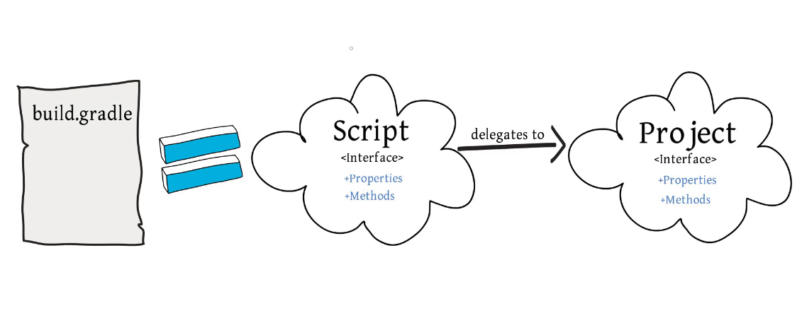
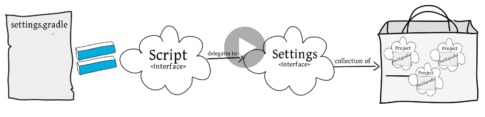
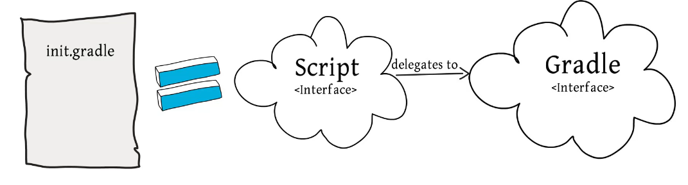
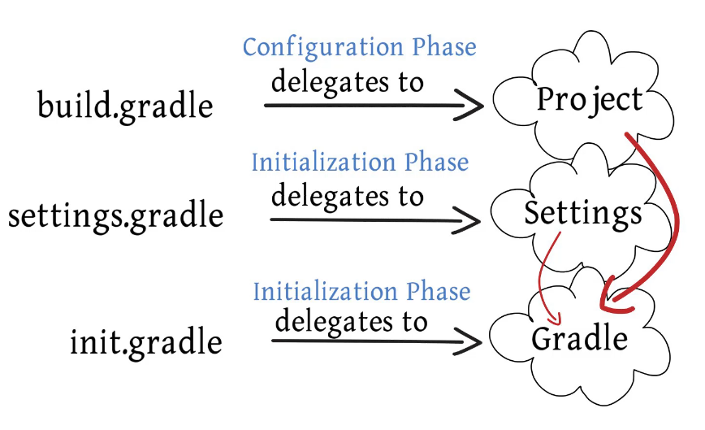

# Destination
Gradle under the hood.

## Setup

the **"init.d"** folder should be placed into **[USER_HOME]/.gradle** to work as expected

## Gradle Lifecycle phases
### 1. Initialization
- creates project instances
- -> init.gradle
- -> settings.gradle

### 2. Configuration
- -> build.gradle

### 3. Execution
- -> tasks from build.gradle

